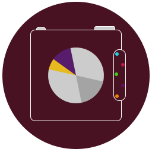
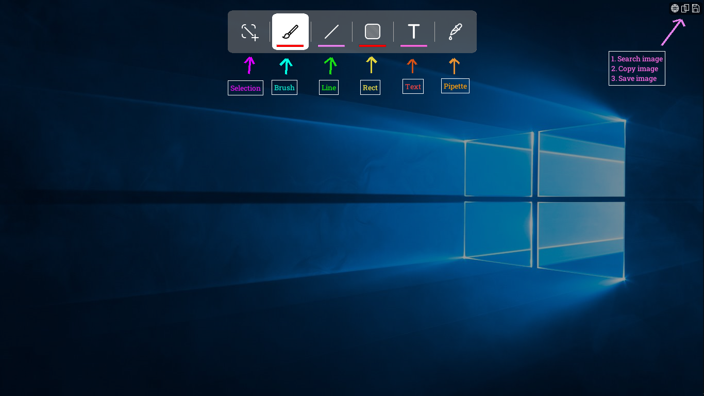

# Trigat 
Trigat is an SDL-based app created to take and edit screenshots quickly and easily.

GUI Icons and design consulting - 

# GUI Screenshot

# Functions
- Screenshot the entire screen or select an area
- Edit screenshot
  - Brush
  - Lines
  - Rectangles
  - Mutliline text
- Pick any color from the screen
- Save image
- Copy image
- Search image with Google Lens

# Hotkeys
| Description                    | Hotkey      |
|--------------------------------|-------------|
| Create screenshot              | **PrtScrn** |
| Quit screenshot menu           | **Escape**  |
| Select the entire screen       | **Ctrl+A**  |
| Draw squares or straight lines | **Shift**   |
| Save image                     | **Ctrl+S**  |
| Copy image                     | **Ctrl+C**  |
| Search image                   | **Ctrl+G**  |

